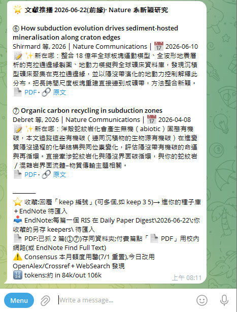
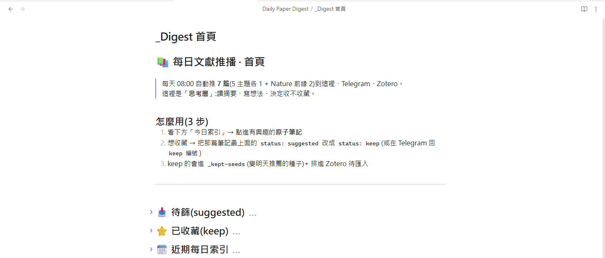
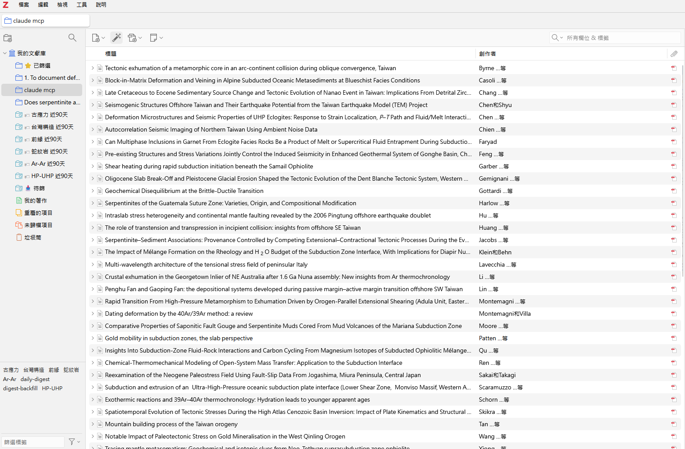
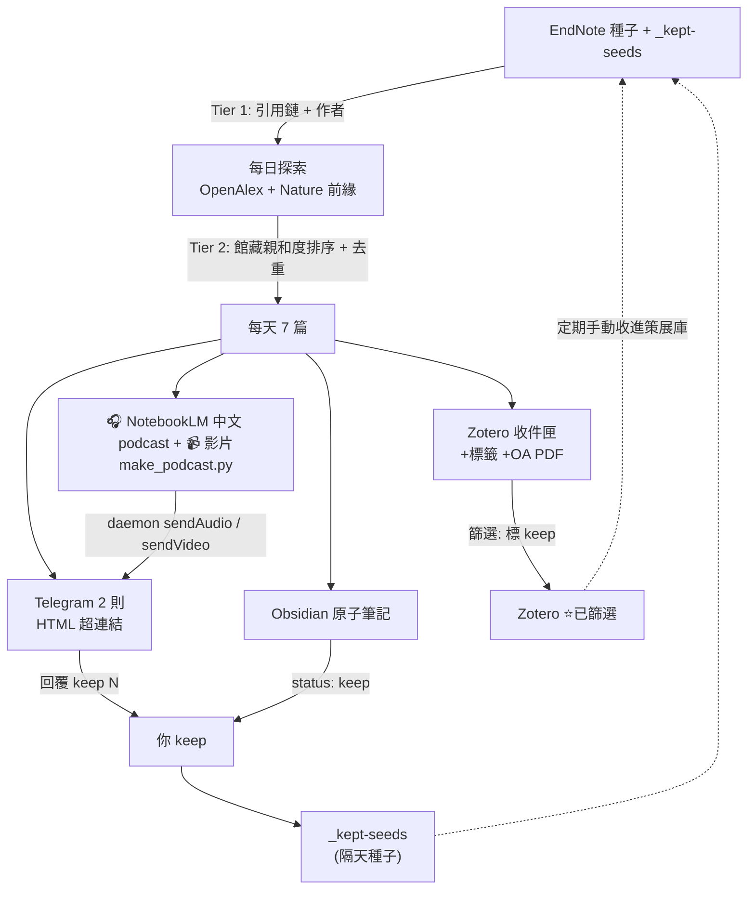

# 📚 EndNote Daily Digest

> Daily literature radar that turns your **EndNote** reference library into a self-curating knowledge pipeline — discover → read → collect → feed back.

每天依你的 **EndNote** 館藏主軸,自動探索相關新論文,分送到 **Telegram**(手機閱讀)、**Zotero**(新知收件匣 + 自動抓 OA PDF)、**Obsidian**(原子筆記,思考層);你在任一處標「收藏」,隔天就回饋成新的探索種子。執行於 **Claude Code 排程**(每天 08:00)。

> 版本變更見 [CHANGELOG.md](CHANGELOG.md) 與 [Releases](https://github.com/FormosaRes/endnote-daily-digest/releases)。

---

## 📸 截圖

| Telegram 每日推播 | Obsidian 儀表板 | Zotero 收件匣 |
|---|---|---|
|  |  |  |

---

## 這是什麼 / Why

不是關鍵字訂閱,而是**以你 EndNote 館藏的引用鏈與作者為種子**去找新文章——所以推的東西真的跟你的研究相關,而且會隨館藏成長而演化。（館藏具體怎麼變成推薦——選種子 → 引用鏈/作者往外找 → 親和度排序——見 [docs/architecture.md#endnote-怎麼決定推什麼相關性的來源](docs/architecture.md)。）

**二庫分離**(設計核心):

| 庫 | 角色 | 讀/寫 |
|----|------|-------|
| **EndNote** | 你過去策展 + 親自挑選的文獻(種子來源) | 只讀 |
| **Zotero** | 每天自動流入的「新知 inbox」 | 自動寫入 |
| **Obsidian** | 思考層(原子筆記、想法、連結) | 自動寫入 |
| **Telegram** | 手機閱讀 + 一鍵收藏 | 推播 |

## ✨ 核心特色

- 🎯 **館藏錨定探索** — Tier 1 引用鏈 + 作者追蹤(OpenAlex),非泛關鍵字。
- 🧠 **親和度排序 + 三重去重** — 對 EndNote(語意/BM25)、Zotero(`find_duplicates`)、歷史 log 去重。
- 📲 **Telegram 精簡推播** — 每天 2 則 HTML 文字超連結,含 publish 日期、加長中文摘要、可點 PDF/原文(格式見 [docs/telegram.md](docs/telegram.md))。
- 📚 **Zotero 自動匯入** — Web API / `zotero_add_by_doi` → 收件匣 collection + 主題標籤 + OA PDF。
- 🗂️ **Obsidian 原子筆記 + Dataview 儀表板** — 每篇一檔,`status` 驅動的「待篩 / 已收藏」動態清單。
- 🔁 **雙閘門收藏 → 種子閉環** — Telegram 回 `keep N`,或 Obsidian 把筆記 `status: keep`;收藏的 DOI 進 `_kept-seeds`,變隔天的探索種子。
- 📄 **OA PDF 自動抓** — Unpaywall / OpenAlex / Semantic Scholar 開放取用版本自動上傳 Zotero;付費牆內容請自行依機構權限取得。
- 🎧 **NotebookLM 中文 Podcast** — 每天 7 篇生成繁中語音,依**逐篇 6 段說書骨架**(問題→方法→結果→意義→關聯→帶走)+ 餵全文 PDF,不是念摘要(`scripts/make_podcast.py`)。
- 🎬 **文章原圖影片** — 抽當天 PDF 的**原圖**做投影片配語音,**不做 AI 生成視覺**;08:15 排程推 Telegram(`scripts/make_video.py`)。

## 🧭 架構(閉環)

完整圖與說明見 **[docs/architecture.md](docs/architecture.md)**。一句話:



## 📋 輸出長什麼樣

同一篇文章會以三種形式落地。以下為**渲染後**示意(完整規格見各 doc)。

### 📲 Telegram(HTML,每天 2 則)

每篇一個 block;訊息1 放 5 主題各 1 篇、訊息2 放前緣 2 篇 + 結尾操作區。完整規格見 **[docs/telegram.md](docs/telegram.md)**。

> 🗺️【大地構造】
> ③ **Regional geochronology and tectonic evolution of an orogenic belt**
> Doe et al., 2026｜Journal of Structural Geology｜📅 2026-06-18
> 📝 以區域構造與定年資料重建造山帶變形歷史,對你的研究方法與既有框架有直接對照。
> 📄 PDF · 🔗 原文

訊息 2 結尾操作區:

```
─────
⭐ 收藏:回覆「keep 編號」(可多個,如 keep 3 9)→ 進你的種子庫＋EndNote 待匯入
📥 EndNote:每篇一個 RIS 在 Daily Paper Digest\{DATE}\;收藏的另存 keepers\ 待匯入
📄 PDF:已抓 N 篇存同資料夾;付費篇點「📄 PDF」用校內網路
🔢 tokens:約 in {tin}/out {tout}
```

### 🗂️ Obsidian 原子筆記(Markdown,每篇一檔)

`status` 驅動 Dataview 儀表板的「待篩 → 已收藏」。完整規格見 **[docs/obsidian.md](docs/obsidian.md)**。

```markdown
---
title: "Regional geochronology and tectonic evolution of an orogenic belt"
authors: "Doe et al."
year: 2026
journal: "Journal of Structural Geology"
doi: 10.1000/example
url: https://doi.org/10.1000/example
pdf: https://example.org/articles/example.pdf
ris: 2026-06-18/03_doe-orogenic-belt.ris
themes: [大地構造]
source: daily-digest
date_suggested: 2026-06-18
digest_number: 3
affinity: 0.82
status: suggested
tags: [paper/suggested]
---

# Regional geochronology and tectonic evolution of an orogenic belt

Doe et al. · 2026 · Journal of Structural Geology · 📅 2026-06-18

📝 以區域構造與定年資料重建造山帶變形歷史,對你的研究方法與既有框架有直接對照。

🔗 [原文](https://doi.org/10.1000/example) · 📄 [PDF](https://example.org/articles/example.pdf)

---
收藏:把 frontmatter 的 `status: suggested` 改成 `status: keep`,或在 Telegram 回 `keep 3`。
```

> 同內容不同語法:**Telegram 用 HTML**(`<b>`、`<a href>`)、**Obsidian 用 Markdown**(`# 標題`、`[文字](url)`)。第三種形式(Zotero 收件匣條目)見 [docs/zotero.md](docs/zotero.md)。

## 🎧🎬 語音 / 影片規範(NotebookLM）

**Podcast 說書骨架** — 逐篇按下列 6 段講(不是念摘要),寫進 source doc 開頭與 generate 指令(`scripts/make_podcast.py`):

| 段 | 講什麼 |
|---|---|
| ① 問題與背景 | 解決什麼問題、為何重要、前人卡在哪(gap) |
| ② 資料與方法 | 樣本/資料、關鍵技術、方法**限制**(相平衡假設、定年前提、反演前提、壓力/溫度計假設) |
| ③ 主要結果 | 關鍵觀察 + **具體數字**(P–T、年代、方向、地溫梯度),對應哪張圖 |
| ④ 解釋與意義 | 作者怎麼解釋、對隱沒/造山/折返框架的意義、爭議或替代解釋 |
| ⑤ 與研究關聯 | 扣回聽眾自己的研究方法與主題(方法學校準、與既有框架的對照) |
| ⑥ 一句話帶走 | 每篇收束 |

七篇講完做 2–3 分鐘**跨篇串連**。**餵當天全文 PDF**(抓得到的);只有摘要的篇講明依摘要、**不編造數字**。

**影片規範** — `scripts/make_video.py`:抽當天文章 PDF 的**原圖**(PyMuPDF)做投影片、配語音 mp3(ffmpeg via imageio-ffmpeg),**只用文章圖、不做 AI 生成視覺**(刻意不使用 NotebookLM 的 video overview)。08:15 排程 `sendVideo`;超過 50MB(Telegram bot 上限)不推。

> 完整安裝(`notebooklm login`、`pip install PyMuPDF Pillow imageio-ffmpeg`)與用法見 [docs/podcast.md](docs/podcast.md)。

## ✅ 開工前需求(Prerequisites)

動手裝之前,先備齊這些——**打勾再往下走**,免得裝到一半才發現少東西:

| 需要 | 用途 | 必要? | 事先要拿到什麼 |
|------|------|:---:|------|
| **EndNote** + [endnote-mcp](https://github.com/gokmengokhan/endnote-mcp) | 種子來源(去重 + 相關性錨定) | 必要 | 會把館藏**匯出成 XML**;裝好 endnote-mcp 並 `index` 過一次 |
| **Claude Code** | 跑每日排程(SKILL.md) | 必要 | 已安裝、可建 scheduled-task |
| **Python 3** | 執行腳本 / daemon | 必要 | 3.x(核心腳本只用標準庫) |
| **Telegram bot** | 手機推播 | 必要 | 找 [@BotFather](https://t.me/BotFather) 開 bot 拿 **bot_token**,再取你的 **chat_id** |
| **Zotero** | 新知 inbox + OA PDF | 必要 | 帳號 + **API key(write 權限)** + library id + inbox collection key |
| **Obsidian** + Dataview | 思考層 + 儀表板 | 選用 | 裝 App;儀表板要另裝 **Dataview** 社群外掛 |
| **NotebookLM** | 中文 podcast / 影片 | 選用 | Google 帳號;`notebooklm-py` login 一次 |

> 只想先跑最小可用版:**EndNote + Claude Code + Python + Telegram + Zotero** 這 5 項即可;Obsidian / NotebookLM 之後再加。

## 🔧 安裝與設定

**1. 相依套件**

核心腳本只用 Python 3 標準庫(`urllib` / `json` / `ssl`),無額外必裝套件。**選用**:Obsidian 儀表板需裝 **Dataview** 社群外掛(見 [docs/obsidian.md](docs/obsidian.md));NotebookLM podcast 需 `uv tool install 'notebooklm-py[browser]'` + `notebooklm login`(見 [docs/podcast.md](docs/podcast.md));影片(`make_video.py`)需 `pip install PyMuPDF Pillow imageio-ffmpeg`(抽圖 / 字幕 / 內建 ffmpeg,免系統安裝)。

**2. 設定檔(金鑰不進 git)**
```bash
cp config.example.json config.json
# 填入:zotero_api_key(需 write 權限) / zotero_library_id / zotero_inbox_collection / mailto
# Telegram daemon:cp telegram-daemon/config.example.json telegram-daemon/config.json,填 bot_token / chat_id
```

**3. 元件就位**
- **排程**:把 `digest/SKILL.md` 放到 Claude Code 的 scheduled-task(cron `0 8 * * *`)。
- **Telegram daemon**:在本機常駐 `telegram-daemon/notify-daemon.py`(開機自動啟動)。
- **MCP**:Claude 連上 EndNote MCP(種子/去重)、Zotero MCP(可選,`zotero_add_by_doi`)。
- **Obsidian**:vault 內建立 `paths.digest_dir` 指的資料夾(每日原子筆記寫入此處),裝 **Dataview** 外掛讓 `_Digest 首頁` 儀表板生效;結構、frontmatter、收藏流程見 [docs/obsidian.md](docs/obsidian.md)。
- **Podcast(選用)**:`uv tool install 'notebooklm-py[browser]'`、`notebooklm login` 一次,之後 `python scripts/make_podcast.py --push` 生成中文語音推到 Telegram。

**4. 裝完怎麼確認在跑**
- **daemon 活著**:程序在,且 `notify-queue.jsonl` 的已讀位置(`.pos`)= 檔案行數(沒有卡住未送的訊息)。
- **手動戳一則**:對 `notify-queue.jsonl` append 一行 `{"message": "test", "parse_mode": "HTML"}`,幾秒內手機該收到 → daemon 正常。
- **排程真的會觸發**:確認 Claude Code scheduled-task 已建、cron = `0 8 * * *`;隔天早上收到 2 則即代表整條通。
- **EndNote 讀得到**:在 Claude 裡試 `search_references`,有回結果代表 MCP 索引就緒(否則先跑 `reindex.bat`)。

## 📄 PDF 策略

| 來源 | 取得方式 | 自動化 |
|------|----------|--------|
| OA 友善站(Nature / Springer / PMC / arXiv / HAL) | Unpaywall / OpenAlex / Semantic Scholar / 直連 | ✅ 全自動上傳 Zotero |
| OA 但 Cloudflare 站(部分 MDPI) | 需真瀏覽器 | ⚠️ 多半失敗,改手動 |
| 付費牆(ScienceDirect / Wiley / GSW …) | **依你所屬機構的訂閱權限自行取得** | ❌ 本專案不處理 |

> 本專案只自動抓「開放取用(OA)」版本。付費牆文章請依你所屬機構的正當訂閱權限自行下載,再用 Zotero 一般附檔流程加入。

## 🔐 安全(務必先做)

- **絕不把 `config.json` 推上 GitHub**(已被 `.gitignore`)。所有金鑰只放 `config.json` / `telegram-daemon/config.json`。
- 本 repo 為「無密鑰」版:腳本內金鑰已換成讀 `config.json`,commit 已驗證**不含 key/token/chat_id**。
- **若金鑰曾外流(貼過、commit 過)→ 先到 Zotero / Telegram 後台輪替一把新的。**
- **Zotero write key 只走「憑證驗證」的 TLS**(api.zotero.org);放寬憑證僅用於 OA PDF 下載等不帶金鑰的連線。

## 🛡️ 穩健性

- **Telegram queue 不會被單筆卡死**:daemon 對永久失敗(>50MB、檔不存在、HTTP 4xx)記 log 後跳過前進,只有暫時性網路錯才重試;`sendAudio` 也有 50MB 上限防護。
- **影片超過 50MB 不再靜默無片**:改推一則帶本機路徑的文字說明(Drive 上傳可日後補)。
- **NotebookLM / ffmpeg 皆有 timeout**;NotebookLM 失敗(如登入過期)會推一則 Telegram 提醒而非靜默結束。
- **語音完成寫 `{DATE}.done` sentinel**,08:15 影片任務等它才動,避免讀到寫到一半的 mp3。
- **影片時長對齊語音**(末幀補時長),向量圖 PDF 退回整頁 render,不會截掉 podcast 尾段或整支產不出。

## 🔁 維護:repo = 單一真相

所有腳本的**金鑰與路徑**都讀 `config.json`(含 `paths` 區),不再寫死。流程:**在 repo 編輯 → `python scripts/sync_live.py` 部署到 live**(live 各自帶一份 `config.json`)。loader 找設定的順序:`DIGEST_CONFIG` 環境變數 → 腳本同層 `config.json` → repo 根 `config.json`。

## 📁 倉庫結構

```
endnote-daily-digest/
├─ digest/
│   └─ SKILL.md              # Claude Code 排程任務的完整邏輯(每天 5主題各1 + Nature 前緣2 = 7 篇)
├─ scripts/
│   ├─ process_keeps.py      # 讀 Telegram「keep N」+ Obsidian status:keep → _kept-seeds + keepers
│   ├─ backfill_zotero.py    # 批次把歷史推播文章補進 Zotero(Crossref 解析 DOI)
│   ├─ attach_pdfs.py        # 抓 OA PDF 並以 imported_file 上傳 Zotero
│   ├─ make_podcast.py       # 7 篇 → NotebookLM 中文 podcast(mp3)+ 可推 Telegram
│   ├─ make_video.py         # 抽當天 PDF 文章原圖 → 投影片配語音 mp4 → 可推 Telegram(非 AI 生圖)
│   ├─ sync_live.py          # 把 repo 腳本部署到 live 工作目錄(repo = 單一真相)
│   └─ reindex.bat           # 重建 endnote-mcp 索引(EndNote 端歸檔後)
├─ telegram-daemon/
│   ├─ notify-daemon.py      # 本機常駐,輪詢 queue → 發 Telegram(HTML 超連結 + sendAudio 推 podcast + sendVideo 推影片)
│   └─ config.example.json
├─ docs/
│   ├─ architecture.md       # 架構與閉環、EndNote 種子機制、PDF 策略
│   ├─ telegram.md           # Telegram 訊息輸出格式(2 則結構、每篇 block、HTML 規則、queue)
│   ├─ podcast.md            # NotebookLM 中文 podcast:安裝/用法/投遞/注意
│   ├─ zotero.md             # Zotero 分類方案、API 設定、配額
│   ├─ obsidian.md           # vault 結構、原子筆記、Dataview 儀表板、收藏流程
│   └─ img/                  # README 截圖
├─ external/                 # 參考用 submodule(不汙染授權,見 external/README.md)
├─ config.example.json
├─ .gitignore
├─ CHANGELOG.md              # 版本變更紀錄(對齊 GitHub Releases)
└─ README.md
```

## ⚠️ 限制與現狀

- 只自動抓 OA PDF;付費牆內容不在本專案範圍。
- **Zotero 免費空間僅 300MB**;滿了可改用 linked_file(連本機 PDF、不佔配額但不同步行動裝置)或升級儲存。詳見 [docs/zotero.md](docs/zotero.md)。
- **Obsidian/Telegram queue 等資料夾若放 iCloud**:iCloud 會還原「移動/改名」,只「新建/改內容」會留——勿在 iCloud 內反覆改腳本或搬檔。

## 🙏 相依 / 致謝

- 探索與後設資料:[OpenAlex](https://openalex.org)、[Crossref](https://crossref.org)、[Unpaywall](https://unpaywall.org)、Semantic Scholar
- 文獻管理:[Zotero](https://zotero.org)(開放讀寫 Web API)、[EndNote](https://endnote.com) + [endnote-mcp](https://github.com/gokmengokhan/endnote-mcp)、[zotero-mcp](https://github.com/54yyyu/zotero-mcp)
- 筆記:[Obsidian](https://obsidian.md) + [Dataview](https://github.com/blacksmithgu/obsidian-dataview)
- 語音:[NotebookLM](https://notebooklm.google.com) via [notebooklm-py](https://github.com/teng-lin/notebooklm-py)
- 編排:[Claude Code](https://claude.com/claude-code)

## 授權

個人專案;整合的第三方各依其授權。
