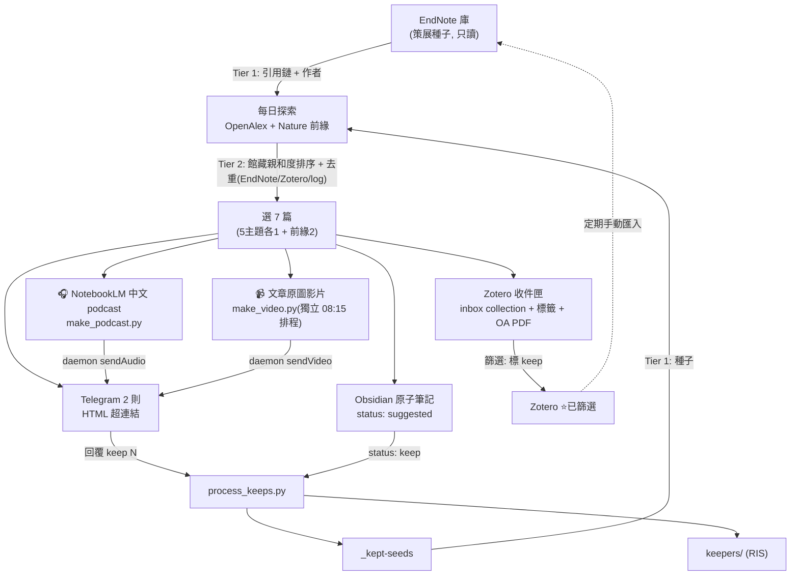
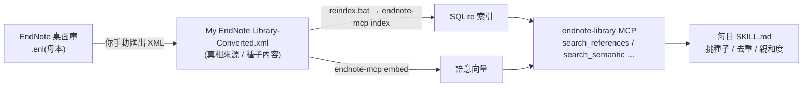

# 架構 / 閉環

**二庫分離**:EndNote = 過去策展 + 親自挑選的(只讀,當種子);Zotero = 每日新知 inbox(自動寫入);Obsidian = 思考層。

## EndNote 怎麼決定推什麼(相關性的來源)

系統**不是關鍵字訂閱,而是把你的館藏當「種子」往外長**。三步:

**① 選種子** — 每主題從 EndNote 挑 2–3 篇「窄而具體」的代表作(例:某個大地構造主題挑一篇聚焦特定造山帶的區域研究、某個地質年代學主題挑一篇針對單一定年方法的案例)。**刻意避開超高被引的通用方法論文**(那種被引 900+、雜訊大的工具型文章),否則會把離題的也拉進來。加上你昨天收藏的 DOI(`_kept-seeds`)→ 閉環。

**② 從種子往外找新文**(OpenAlex API,三條路,與獨立主題/Nature 搜尋**並用**避免回音室):
- **引用鏈** — 找近一年「引用了你種子論文」的新文(`filter=cites:{Wid}`),通常正中主題。
- **作者追蹤** — 從館藏萃取高頻作者(例:Author A / Author B…)→ 抓其近期新作。
- **關鍵字收割** — 用館藏 Keywords 欄位(你自己的術語)當額外查詢詞。

**③ 親和度排序 + 去重** — 決定哪些夠像、值得推:
- 每個候選算「跟館藏有多像」:有 semantic 用向量命中,無則用 `search_references` 的 BM25 命中數。
- 命中多且近 = 高親和排前;離題者(例:某篇通用方法論文被大量不同次領域引用而拉進來的雜訊)親和度低會落選。
- 已在館藏 / 已推過(log)/ Zotero 的直接跳掉。
- 每主題取親和度最高 1 篇 + 前緣 2 篇 = 7 篇。

> 一句話:**館藏決定「從哪開始找」(種子)、「往誰找」(引用鏈+作者)、「哪些夠像」(親和度排序)。**
> SKILL.md 裡稱 **Tier 1(找)/ Tier 2(排序)**。

### 種子從哪來:`.enl → XML → MCP 索引`

種子的**內容**來自你的 EndNote 館藏,但管線不是直接讀 EndNote,而是讀一份**匯出的 XML 快照**經 endnote-mcp 索引後的搜尋層:

- **XML = 真相來源**;**MCP = 派生快照 + 搜尋介面**。兩者是同一份資料的兩個階段,不是二選一。
- ⚠️ **MCP 只認得「上次 reindex 時 XML 裡有的東西」。** 你在 EndNote 新增文獻但沒有重新匯出 XML + 跑 `reindex.bat`,那些新文就**不會被當種子、去重也會漏**。這就是下面「外圈」必須定期手動做的原因。

## 每日流程(SKILL.md 的 0–12 步,摘要)
0. `process_keeps.py`:把昨天的收藏(Telegram `keep`/Obsidian `status:keep`)→ `_kept-seeds` + `keepers/`。
1–2. 讀去重 log。
3. 搜尋:主題關鍵字 + **EndNote 聯動 Tier 1**(引用鏈、作者、關鍵字收割);主題6 限 `nature.com`。
4. 建候選,去重:DOI 在 log / EndNote / Zotero 命中 → 跳。
5. **Tier 2 親和度排序** → 主題1–5 各取 1 + 前緣 2 = 7 篇。
6. OpenAlex/Crossref enrich(publish 日期、摘要、作者、OA PDF)。
7. 存當天資料夾:每篇一個 `.ris` + 抓得到的 PDF。
8. 寫 Obsidian 原子筆記 + 每日索引 + manifest。
9. 更新去重 log。
10. 算 token(讀自己的轉錄檔)。
11. 推 2 則 Telegram(parse_mode HTML)+ 匯入 Zotero。
12.(選用)`make_podcast.py`:7 篇 → NotebookLM 中文 podcast(mp3),經 daemon `sendAudio` 推回 Telegram。**影片是獨立的 08:15 排程** `make_video.py`(抽當天 PDF 原圖做投影片配 mp3,`sendVideo`),不由本任務產生。

## 內圈(每天自動)
種子(EndNote + `_kept-seeds`)→ 探索 → 去重/排序 → 7 篇 → 分送(Telegram / Zotero / Obsidian + 選用 NotebookLM 語音/影片)。你 keep 的隔天變種子。**這圈不需要任何手動步驟即可閉合**(靠去重 log + kept-seeds)。

## 外圈(你定期手動)
Zotero 收件匣篩選 → 值得的標 `keep` / 拖進專案夾 → 定期把這些收進 EndNote 策展庫(匯入 RIS → 匯出 XML → `reindex.bat`)。EndNote MCP 唯讀,只能這樣寫回。

## 資料儲存
| 檔/夾 | 用途 |
|-------|------|
| `_recommended-log.md` | 去重:已推過的 DOI(避免重複) |
| `_kept-seeds.md` | 你收藏的 DOI = 隔天 Tier 1 種子(閉環) |
| `keepers/` | 收藏文章的 RIS(EndNote 批次匯入用) |
| `papers/{DATE}-{slug}.md` | 每篇原子筆記(frontmatter `status`) |
| `papers/_manifest-{DATE}.json` | 編號→DOI 映射(供 `keep N` 對應) |
| `{DATE}.md` | 每日索引(連到原子筆記) |

## PDF 抓取策略
- **OA 友善站**(Nature/Springer/PMC/arXiv/HAL):`attach_pdfs.py` 經 Unpaywall / OpenAlex / Semantic Scholar 找開放取用版本,直連抓下並上傳 Zotero。
- **Cloudflare 站**(部分 MDPI 等):無頭工具常被 TLS 指紋 + JS 挑戰擋,多半失敗,需真瀏覽器手動取得。
- **付費牆**(ScienceDirect/Wiley/GSW …):本專案**不處理**;請依你所屬機構的正當訂閱權限自行下載,再用 Zotero 一般附檔流程加入。
