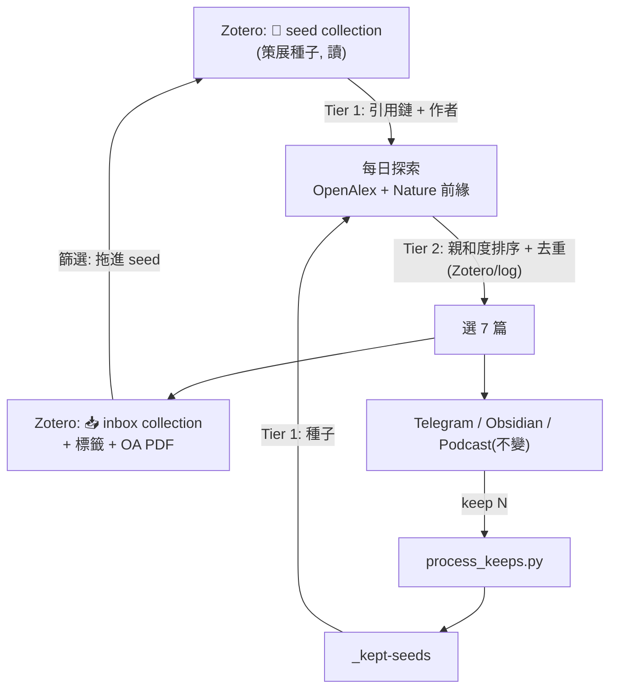

# EndNote → Zotero 遷移指南

> 為什麼要搬:學生版 EndNote 訂閱到期後就不能用了。本指南說明如何把整條「每日文獻雷達」從**依賴 EndNote** 改成**只靠 Zotero** —— 你目前免費、且已在用的那個庫。
>
> 這份文件是「**先看懂再動手**」用的:先講清楚要改什麼、為什麼,以及一步步怎麼做。**它本身不改動核心程式**(SKILL.md / 腳本)。真正的程式改寫是第 5 節的清單,做不做、何時做,由你決定。

---

## 1. 現在 EndNote 被用在哪兩個角色

你的系統是「[二庫分離](architecture.md)」設計,EndNote 同時扛**兩個**角色:

| 角色 | 做什麼 | 靠什麼實現 |
|------|--------|-----------|
| **A. 讀端:相關性種子來源** | 挑窄種子 → 引用鏈/作者追蹤 → 算親和度 → 去重 | `endnote-mcp`(`search_references` / `list_references_by_topic` / `find_related`)讀一份匯出的 `My EndNote Library-Converted.xml` 索引 |
| **B. 寫端:長期典藏庫** | 你 keep 的好文最後歸檔的地方 | `keepers/*.ris` 手動匯入 EndNote → Find Full Text → 匯出 XML → `reindex.bat` |

Zotero 目前只是**只寫的「新知 inbox」**(每天 7 篇流進來)。

**EndNote 一停用,A 和 B 同時消失。** 這兩個角色都得改由 Zotero 一庫承擔 —— 而 Zotero 本來就已經在你的管線裡,只是之前只當收件匣。

---

## 2. 搬完之後長什麼樣:一庫、兩個 collection

不需要再維護兩套軟體。Zotero 一個帳號裡開**兩個 collection**,把原本二庫的角色分清楚:

| Zotero collection | 對應原本的 | 讀/寫 |
|-------------------|-----------|-------|
| **策展庫 `seed`**(新開,建議名 `🌱 Curated / Seeds`) | 原 EndNote 策展庫(角色 A) | 種子來源(讀)+ 你定期把篩選過的收進來(寫) |
| **收件匣 `inbox`**(`zotero_inbox_collection`,已存在) | 原 Zotero inbox | 每天 7 篇自動流入(寫)、你在裡面篩(讀) |

閉環變成**同一個 Zotero 內部的搬移**:收件匣篩到值得的 → 標 `keep` / 拖進 `seed` collection → 隔天它就成為新的種子。原本「Zotero 篩完再匯回 EndNote」那條跨軟體的外圈**消失了**,流程反而更短。



---

## 3. `WenyuChiou/zotero-skills` 是什麼、幫得上什麼

這是給 AI coding 助手(Claude Code / Cursor)用的 **Zotero 技能包**,核心價值是給你 **Zotero 的完整讀寫(CRUD)** —— 正好補上取代 EndNote 讀端(角色 A)所缺的「讀 Zotero 館藏」能力。

它提供:

- **雙 API 架構**:本機 API(`http://localhost:23119`,Zotero 桌面版開著時讀很快)+ Zotero Web API(負責寫);桌面沒開會自動退回純 Web 模式。
- **讀**:全文搜尋、標籤過濾、找重複(`find_duplicates`)、讀條目 metadata。
- **寫**:建各類條目(期刊文章/書/論文…)、改 metadata、管標籤、搬 collection、附 HTML 筆記、建階層資料夾、批次操作。
- 附一個 `zotero_client.py` Python 函式庫可直接 import 進專案,還有各條目型別的 JSON 範本。
- 內建 rate limiting,避免打爆 Zotero 配額。

> ⚠️ zotero-skills 本身**沒有** EndNote 匯入功能;第 4 節的資料搬家要另外做(用 EndNote/Zotero 內建的匯出匯入)。

**它跟 `zotero-mcp` 的差別**:README 已提到的 [`zotero-mcp`](https://github.com/54yyyu/zotero-mcp) 是 MCP server(`zotero_add_by_doi` 等,Claude 連上即用,`add_by_doi` 會自動串 Unpaywall/arXiv/S2/PMC 抓 OA PDF)。zotero-skills 則是「skill + Python client」形式。兩者能力重疊,選哪個看你想怎麼接(見第 6 節)。

---

## 4. 資料搬家(一次性,務必先做)

在 EndNote 還能開的**這一個月內**先搬,別拖到訂閱過期打不開庫。

### 4.1 從 EndNote 匯出

Zotero 對 **RIS** 的匯入最穩,建議走 RIS:

1. EndNote 開啟你的庫。
2. `Edit → Output Styles → Open Style Manager`,勾選 **RefMan (RIS) Export**(讓它出現在樣式選單)。
3. 全選所有文獻(`Ctrl+A`)。
4. `File → Export`,`Save as type` 選 **Text File (*.txt)**,`Output style` 選 **RefMan (RIS) Export**,存成 `endnote-library.ris`。
5. (可選,保附件)若要一起帶 PDF 附件,改用 `File → Export` 前先確認附件是「相對路徑」;RIS 不一定能帶檔案連結,PDF 多半要在 Zotero 端重抓或手動拖。**metadata 一定搬得過去,PDF 附件視情況**。

> 替代路徑:EndNote 也能匯出 **XML**(`My EndNote Library-Converted.xml`,就是你現在餵 endnote-mcp 那份)。Zotero 可裝「EndNote XML」translator 匯入,但 RIS 相容性通常更好,**優先用 RIS**。

### 4.2 匯進 Zotero

1. Zotero 桌面版 `File → Import`,選 `endnote-library.ris`,格式選 RIS。
2. 匯入時勾「**Place imported collections and items into a new collection**」→ 這個新 collection 就命名為 `🌱 Curated / Seeds`(= 我們的 `seed` collection)。
3. 匯完抽查幾筆:標題、作者、DOI、年份、期刊有沒有跑掉。DOI 尤其重要 —— 種子引用鏈全靠它。
4. 記下這個 collection 的 **key**(Zotero 桌面版右鍵 collection →「複製連結」或用 Web API `GET /collections` 查)。這個 key 之後要填進 config。

### 4.3 附件 / PDF

- Zotero 免費雲端只有 **300MB**(見 [zotero.md](zotero.md))。若 EndNote 附件多,別全上傳雲端 —— 用 `linked_file`(連本機 PDF、不佔配額)或只搬 metadata、PDF 之後按需重抓。
- 你的每日 pipeline 本來就只自動抓 OA PDF,策展庫的舊 PDF 不是每天流程的必要輸入,**可以晚點再處理**。

### 4.4 驗收

- Zotero 裡 `seed` collection 條目數 ≈ EndNote 庫文獻數。
- 隨機抽 5 筆,DOI 存在且正確。
- 這時你就有「Zotero 版的種子來源」了,程式改寫(第 5 節)才能讀到東西。

---

## 5. 程式改寫清單(逐檔)

以下是把讀端(角色 A)與典藏端(角色 B)從 EndNote 換成 Zotero 要動的地方。**做之前先完成第 4 節資料搬家**,否則改完讀到空的。

### 5.1 `config.json` / `config.example.json`

新增一個欄位指向策展 collection:

```jsonc
{
  "zotero_api_key": "...",              // 已有(需 write)
  "zotero_library_id": "...",           // 已有
  "zotero_library_type": "user",        // 已有
  "zotero_inbox_collection": "...",     // 已有:收件匣
  "zotero_seed_collection": "SEEDKEY",  // ★新增:第 4.2 拿到的策展 collection key
  "mailto": "you@example.com"
}
```

### 5.2 `digest/SKILL.md`(核心邏輯,改動最多)

| 位置 | 現況(EndNote) | 改成(Zotero) |
|------|---------------|--------------|
| `## Tools` 的 **EndNote MCP** 那條 | `mcp__endnote-library__*`,`search_references` 挑種子、FTS5 不能含 `/` `.` | 改成「讀 Zotero seed collection」:Web API `GET /collections/{seed}/items`(見 5.5)或 zotero-mcp/zotero-skills 搜尋 |
| `## EndNote 聯動 — 錨定相關性` 整節 | 用 `search_references`/`list_references_by_topic` 挑窄種子取 DOI | 改成「從 `seed` collection 撈條目 → 取 `DOI` 欄位當種子」;主題篩選改用 Zotero **標籤**或條目所屬子 collection |
| **Tier 1** 步驟 1「選種子」 | `search_references` 取近 6 年窄種子 | Zotero API 拉 `seed` collection 條目,依標籤/年份挑窄種子(邏輯不變,只換資料源) |
| **Tier 2** 去重 | DOI 在「log / EndNote / Zotero」命中就跳 | 去重來源改成「**log / Zotero(seed+inbox)**」;EndNote 那路刪掉 |
| Step 0、閉環段的 `keepers/` + `reindex.bat` | keep 的存 RIS,定期匯回 EndNote + reindex | 改成:keep 的直接**在 Zotero 內從 inbox 搬進 seed collection**(見 5.4),不再產 RIS-for-EndNote、不再 reindex |
| 訊息 2 結尾操作區的「📥 EndNote / RIS」文案 | 「keepers\ 待匯入 EndNote」 | 改文案:收藏 = 進 seed collection;RIS 仍可留給想匯入其他工具的人,但不再是 EndNote 專用 |

> 親和度計算(Tier 2)本來就在 `reservoir.py` 內用引用鏈/關鍵字/期刊/摘要算,**不依賴 EndNote 語意向量也能跑**;把 SKILL.md 裡「有 semantic 用向量、無則 BM25」那句改成「以 Zotero seed 命中 + 引用鏈來源」即可。

### 5.3 `scripts/reservoir.py`

- harvest 時的「館藏種子」來源:目前吃 `_kept-seeds.md` + 每主題固定窄種子。**新增**「從 Zotero seed collection 拉 DOI 當種子」的函式(Web API,見 5.5)。
- 若之前有任何直接呼叫 endnote-mcp 的地方 → 換成讀 Zotero。(依 grep,`reservoir.py` 主要靠 OpenAlex + 種子檔,對 EndNote 依賴輕,改動小。)

### 5.4 `scripts/process_keeps.py`

- 現在:讀 `keep N` → 寫 `_kept-seeds.md` + `keepers/*.ris`(給 EndNote 匯入)。
- 改成:除了 `_kept-seeds.md`(閉環種子照留),把 keep 的 DOI **在 Zotero 內從 `inbox` 加進 `seed` collection**(Web API:`POST /items/{key}` 更新 `collections` 陣列,或 `zotero-skills` 的搬 collection 操作)。
- `keepers/*.ris` 可保留當備份,但不再是「待匯入 EndNote」的必要產物。

### 5.5 讀 Zotero seed collection 的最小程式(Web API 範例)

沿用你專案既有風格(只用標準庫 urllib,不裝東西):

```python
import json, ssl, urllib.request

def zotero_seed_dois(cfg):
    """回傳 seed collection 內所有條目的 DOI 清單,當引用鏈種子。"""
    lib  = cfg["zotero_library_id"]
    coll = cfg["zotero_seed_collection"]
    key  = cfg["zotero_api_key"]
    dois, start = [], 0
    ctx = ssl.create_default_context()   # 帶金鑰 → 走憑證驗證的 TLS(勿放寬)
    while True:
        url = (f"https://api.zotero.org/users/{lib}/collections/{coll}/items"
               f"?format=json&limit=100&start={start}")
        req = urllib.request.Request(url, headers={"Zotero-API-Key": key})
        with urllib.request.urlopen(req, context=ctx) as r:
            batch = json.load(r)
        if not batch:
            break
        for it in batch:
            doi = (it.get("data", {}).get("DOI") or "").strip()
            if doi:
                dois.append(doi.lower())
        start += 100
    return dois
```

拿到 DOI 後,後面「OpenAlex 取 `W…` id → `filter=cites:{Wid}` 引用鏈 / 作者追蹤」的邏輯**完全不用改** —— 種子內容一樣是 DOI,只是來源從 endnote-mcp 換成 Zotero。

### 5.6 文件

- `docs/architecture.md`:二庫圖 → 一庫兩 collection 圖(本文件第 2 節可直接搬過去)。
- `docs/zotero.md`:加上 `seed` collection 的角色與 `zotero_seed_collection` 設定。
- `README.md`:「二庫分離」表格與 Prerequisites 的 EndNote 那列 → 改成 Zotero seed collection;`endnote-mcp` 必要性下修為「選用/歷史」。
- `external/`、`.gitmodules`:`endnote-mcp` submodule 可留作歷史參考(標註「已停用」),或移除。

### 5.7 可以先不動的

- `make_podcast.py` / `make_video.py` / `telegram-daemon/` / Obsidian 那套 —— 對 EndNote 沒有實質依賴(grep 命中多半是說明文字),**不用改邏輯**,只要順手更新註解文案。

---

## 6. 讀 Zotero 的方式:選一個

| 方式 | 優點 | 代價 | 建議 |
|------|------|------|------|
| **A. Zotero Web API**(urllib) | 沿用專案既有風格、零額外安裝、桌面不用開、排程環境穩 | 沒有現成的語意搜尋(但你的親和度本來就靠引用鏈/關鍵字,不缺它) | ✅ **推薦當預設** —— 改動最小、最貼合你「腳本只用標準庫」的原則 |
| **B. `zotero-mcp`** | Claude 連上即用,`add_by_doi` 自動抓 OA PDF | 多一個 MCP 元件要設定 | 想在 Claude 對話裡即時操作 Zotero 時加 |
| **C. `WenyuChiou/zotero-skills`** | 讀寫最全(全文檢索、find_duplicates、批次) | 多裝 skill + client,本機 API 要桌面開著才快 | 想要更完整的 Zotero 自動化管理時用 |

**推薦**:核心每日管線走 **A(Web API)**,因為它跟你「腳本只用標準庫、追求省 token/省依賴、要能無人排程」的設計原則最一致;把 zotero-skills/zotero-mcp 當「在 Claude 裡手動整理 Zotero」的輔助工具即可。三者可並存,不互斥。

---

## 7. 建議執行順序

1. **(本月內,趁 EndNote 還能開)** 第 4 節:匯出 RIS → 匯進 Zotero `seed` collection → 記下 collection key。✅ 這步最急,做完資料就安全了。
2. config 加 `zotero_seed_collection`(5.1)。
3. 加 `zotero_seed_dois()` 讀取函式(5.5),先單獨跑通、確認撈得到 DOI。
4. 改 `reservoir.py` harvest 用它當種子(5.3)。
5. 改 `process_keeps.py` 的 keep → 搬進 seed collection(5.4)。
6. 改 `SKILL.md` 的 Tools / EndNote 聯動 / 去重 / 結尾文案(5.2)。
7. 更新 `architecture.md` / `zotero.md` / `README.md`(5.6)。
8. 跑一天完整流程驗收:種子撈得到、7 篇選得出、去重正常、keep 能搬進 seed。

> **最關鍵、最不可逆的是第 1 步。** 只要 EndNote 庫的資料安全落進 Zotero,後面的程式改寫慢慢做都行,舊系統也還能平行跑到訂閱到期。
